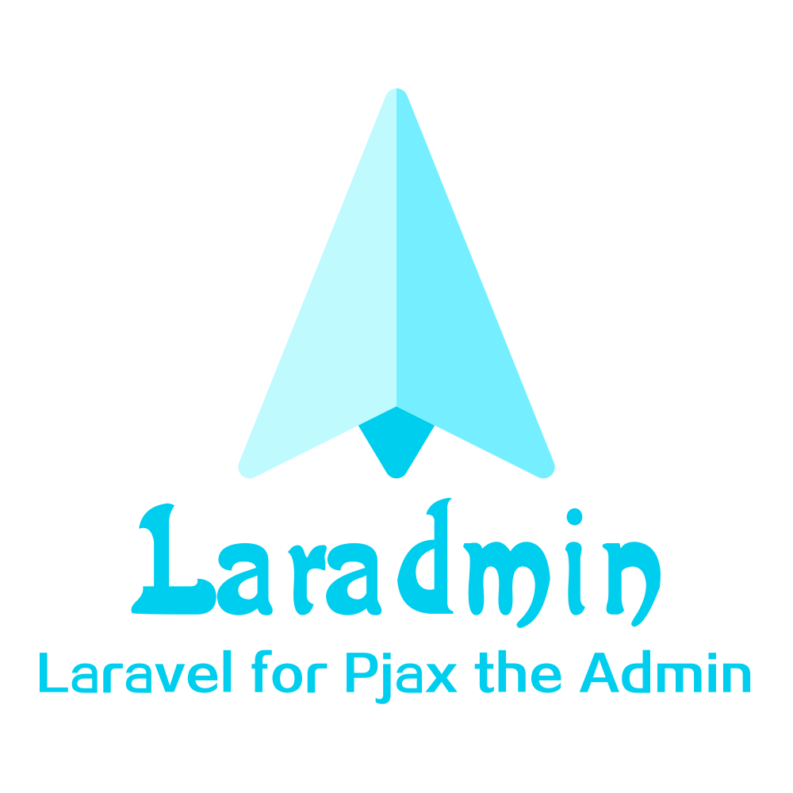

<p align="center"></p>

<p align="center">Laravel for Pjax the Admin</p>

## Install

1. 克隆项目

```shell
$ git clone https://github.com/hkzj0571/Laravel-Admin
```

2. 安装依赖

```shell
$ composer install
```

3. 运行数据库迁移

```shell
$ php artisan migrate
```

4. 生成基本数据

```shell
$ php artisan db:seed
```

后台入口

```shell
$ http://www.yourdomain.dev/admin
```

测试用户

```shell
admin@admin.com
123456
```

# License

MIT 